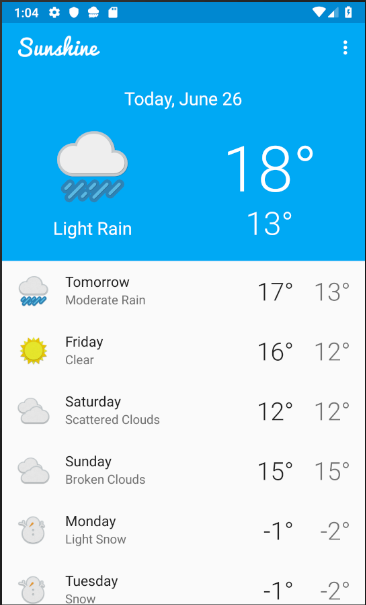
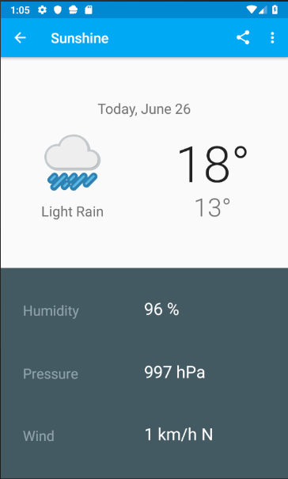
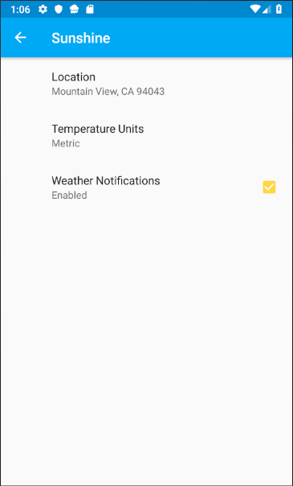

# projectSunshine

This project was the result of completing the following course:

**Developing Android Apps**

Course can be found [here]

## Screenshots

### Home Screen

### Detail Screen

### Settings Screen

## Relevant course material

1. RecyclerView
2. Intents
3. Lifecycle
4. Preferences
5. Content Providers
6. Data Storage
7. Services
8. Notifications
9. Background Tasks
10. Layout & Design
11. Styles & Themes
12. Database Creation
13. Unit Tests

[here]: https://www.udacity.com/course/new-android-fundamentals--ud851#